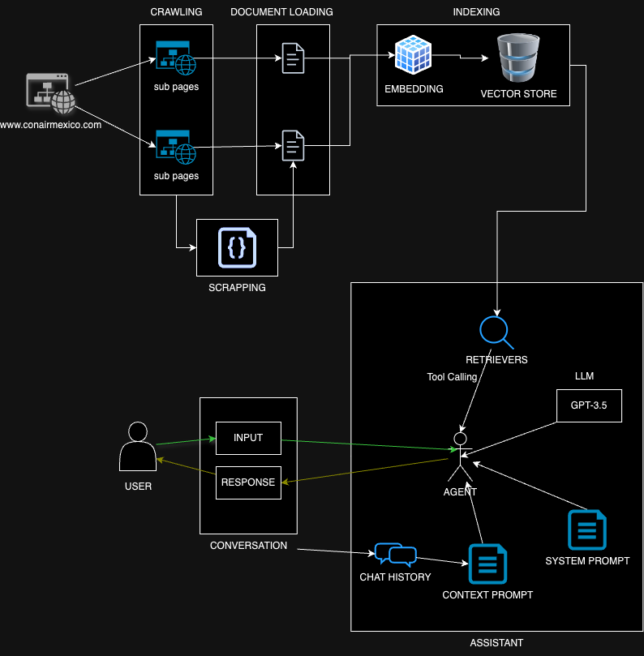

# Visito task: Chatbot with RAG for Conair Mexico

## Solution Development

### Objective & Requirements

This task aims to develop a chatbot that can retrieve data from www.conairmexico.com website, and answer according to this context, being able to mantain conversation history across multiple prompts. In addition, to provide a way to test the chatbot.

### Solution Proposal



The above diagram represents the solution proposal for solving the task. This solution is composed of 5 modules: Crawling & Scrapping, Document Loaders, Indexing, Assistant and Interface. 

* **_Crawling & Scrapping_**: This module is composed of two sub-modules, the _Crawling module_ allow the system to crawl/fetch all the sub-pages from the website root (www.conairmexico.com), and _Scrapping module_ aids to extract unstructured data. The _Scrapping module_ was proposed as a simple version of fetching structured information from tables, as the ones found in www.conairmexico.com/contact-us.html, and product info such as price, description, etc. 

* **_Document Loaders_**: In this module, raw data from each sub-page, is loaded in two different ways. The first loader is in charge of loading HTML, transform as human readable text. The second is loaded as JSON-like format with information from unstructured pages. 

* **_Indexing_**: First, all the context is embedded in a vector-like way using an OpenAI embedding function, then the embedding is stored in a so called vector store. For this purpose it has been used FAISS database in local.

* **_Assistant_**: The Assistant is made one principal actor called Agent, and 4 secondary tools: 1) an LLM model, 2) System Prompt, 3) Retriever, and 4) Chat History. The LLM is a pretrained model GPT-3.5 (OpenAI API grabbed), the System Prompt is the initial instruction for the Assistant (behavor), the Retriever is the tool for searching (by similarity search algorithm) information in all the data loaded from the website, and the Chat History saves the conversation for feed the Context Prompt for keeping the context. Finally, the Agent is in charge of calling the tools as needed, and to give a response according with the user query.

* **_Interface_**: The Interface has been made to allow test the chatbot in a friendly manner.


## Run Instructions

### Clone repository

```
git clone https://github.com/caaxgave/visito_test
```

### Install

Create a python virtual environment, and activate it.

```
python -m venv venv
cd venv/bin
source activate
```

Come back to the `visito_test` directory, and install required packages with requirements.

```
cd ../..
pip install -r requirements.txt
```

### Environment Variables

Since this proposal is using a GPT model from OpenAI API, it is necessary to use an OpenAI key. Please, create an `.env` file with this key as environment variable. Here https://platform.openai.com/api-keys you can create and get your OpenAI API key.

```
OPENAI_API_KEY="<your-key-here>"
```

Furthermore, if you want to keep track of the tool callings, you could use LangSmith. For this it is necessary to include the following env variables to your `.env` file, and you will also have to add your LangChain API key. Here https://smith.langchain.com/settings you can create and get your LangChain API key

```
KMP_DUPLICATE_LIB_OK=TRUE
LANGCHAIN_TRACING_V2=true
LANGCHAIN_ENDPOINT="https://api.smith.langchain.com"
LANGCHAIN_API_KEY="<your-langchain-key>"
LANGCHAIN_PROJECT="conair-chatbot"
```

### Run

There are three starting points from which to run the application. However it is recommended to run the previous crawled list of urls and indexes for a quick deploy, otherwise, it could take around 30 minutes to do the complete process.

 1. Crawling -> Indexing -> Interface:

    ```
    python app.py --run_from crawling 
    ```
    Bear in mind that this will take a few minutes depending on your computer capacity. It took about 5 minutes in MacOs with 8gb and with an M1 chip.

2. Indexing -> Interface:

    ```
    python app.py --run_from indexing 
    ```
    This takes a previous JSON document with all the sub pages already crawled. Bare in mind that this could take a few minutes. It took about 30 minutes in MacOs with 8gb and with an M1 chip.

3. Interface:

    ```
    python app.py 
    ```
    This takes previous generated indexes document with the vector stores. This is recommended for having the out-of-the-box chatbot.
